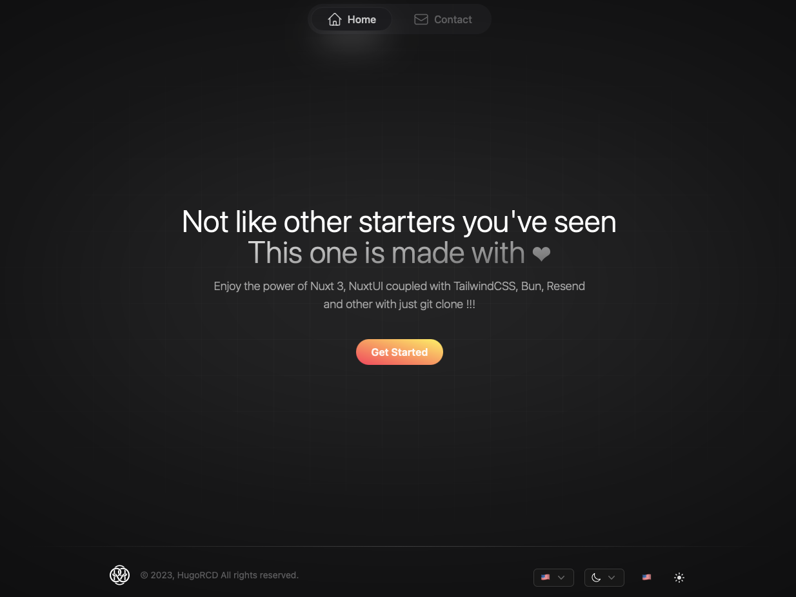

# Nuxt Boilerplate

[](https://www.codacy.com/gh/hugoRCD/nuxtjs-boilerplate/dashboard?utm_source=github.com&amp;utm_medium=referral&amp;utm_content=hugoRCD/nuxtjs-boilerplate&amp;utm_campaign=Badge_Grade)

This is a fully functional Nuxt 3 template that includes features such as translation with I18n, a dark and light theme and many more.
It is built with the latest version of Nuxt and uses bun as package manager, which helps to keep the application lightweight and fast.
All the template has been made to be as simple as possible to use and to be easily customizable, also I have spent a lot of time to make it as clean as possible with good locale management, seo, accessibility, but also with a good folder structure and a good code quality.



## Features

### UI/UX
- Translation with I18n for multiple languages support
- Dark and light theme switchable by the user
- Fully responsive design using SCSS

### SEO
- SEO friendly with meta tags and Open Graph tags
- Sitemap generation
- Robots.txt generation

### Deployment
- Include [Docker](https://www.docker.com/)  configuration using a Dockerfile and Docker-compose
- Easily deploy the application in a container running on port 8080
- simply run `docker-compose up` to start the application

### Lint
- Eslint is configure on the boilerplate (configure for Typescript, with Prettier)

## Console
This application includes a powerful console that can be launched
by using the shortcut `cmd + k`. This console can provide various
features to facilitate development and management of the application but you
will need to develop your own commands. the console in the boilerplate
is just an example of what you can do with it.

## Getting Started

### Clone the repository:
```
git clone git@github.com:hugoRCD/nuxt3-boilerplate.git
```

### Install dependencies:
```
bun install
```
There is no need to use the --shamefully-hoist flag here
because the dependencies the flag is set to true by default in the .npmrc file.

### Start the development server:
```
bun dev
```

Now you can open the app in your browser at http://localhost:3000 if you do not override the default port.

## To Do
- [ ] Add a more complete documentation
- [ ] Add some components
- [ ] Add Authentification (OAuth2, JWT, ...)
- [ ] Add a blog page

## Built With

- [Nuxt.js](https://nuxtjs.org/) - The Progressive JavaScript Framework
- [NuxtUI](https://ui.nuxt.com) - Nuxt UI is a Vue UI Library with Tailwind CSS for Nuxt
- [Resend](https://resend.com/home) - Resend is a modern email client for developers
- [Bun](https://bun.sh/) - Bun is a fast, really fast JavaScript runtime

## License

This project is licensed under the MIT License - see the [LICENSE](./LICENSE) file for details